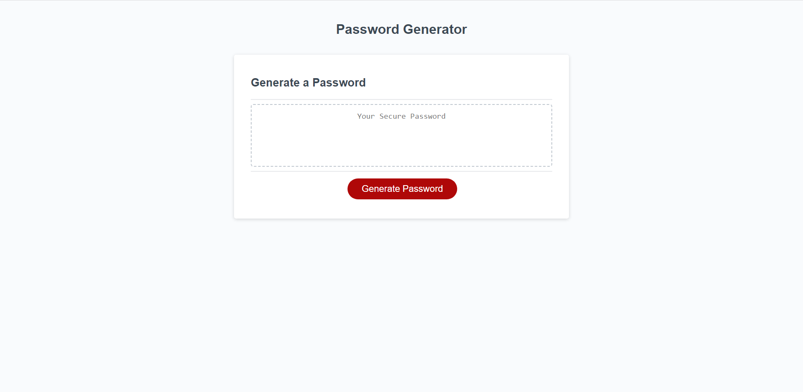

Challenge-3

Link To live website:
 
Description

The purpose of this project was to build a random password generator when given starter code. By expanding on the code given to me in this project, I will be able to apply some of the core principles of Javascript that I learned in the bootcamp. By applying these principles, I will also be able to get more used to the logic of how Javascript works compared to CSS and HTML. To achieve these goals, I worked soley on the Javascript code given to me. One of the main functions I used was if statements. I spent multiple hours trying to decide whether to use one big if else statement, or multiple if statements. I eventually decided on the latter, as I was unable to do the former. I also stored most of my work in the the function generatePassword, and created multiple arrays to create a bank of characters to use for the random password generator. Although I was stumped at first, I realized the string method concat was perfect for this project. I was only able to realize it when I looked back at the notes where it was previously mentioned. The for loop function also took a while to create, but breaking down the function using pseudocoding helped a good amount.  Throughout the project, I was able to reinforce my knowledge on basic Javascript principles and understand using outside learning resources to achieve my goal.

Installation

N/A

Usage

To use the password generator, simply click on the red generate password button in the middle of the screen. a series of prompts will then show up, and once those prompts are answered and the password requirements are met, a random set of characters based on the number of letters you chose will show up in the dotted box. If, for example, your desired password length is not between 8-128 characters, or you did not pick at least one of the character types from the prompts, an alert pop up after choosing the prompts that will say you did not meet one of those requirements.

Credits N/A

License MIT License

Copyright (c) 2023 Joshua Lam

Permission is hereby granted, free of charge, to any person obtaining a copy of this software and associated documentation files (the "Software"), to deal in the Software without restriction, including without limitation the rights to use, copy, modify, merge, publish, distribute, sublicense, and/or sell copies of the Software, and to permit persons to whom the Software is furnished to do so, subject to the following conditions:

The above copyright notice and this permission notice shall be included in all copies or substantial portions of the Software.

THE SOFTWARE IS PROVIDED "AS IS", WITHOUT WARRANTY OF ANY KIND, EXPRESS OR IMPLIED, INCLUDING BUT NOT LIMITED TO THE WARRANTIES OF MERCHANTABILITY, FITNESS FOR A PARTICULAR PURPOSE AND NONINFRINGEMENT. IN NO EVENT SHALL THE AUTHORS OR COPYRIGHT HOLDERS BE LIABLE FOR ANY CLAIM, DAMAGES OR OTHER LIABILITY, WHETHER IN AN ACTION OF CONTRACT, TORT OR OTHERWISE, ARISING FROM, OUT OF OR IN CONNECTION WITH THE SOFTWARE OR THE USE OR OTHER DEALINGS IN THE SOFTWARE.

🏆 The previous sections are the bare minimum, and your project will ultimately determine the content of this document. You might also want to consider adding the following sections.

Badges N/A

Features N/A

How to Contribute N/A

Tests N/A
